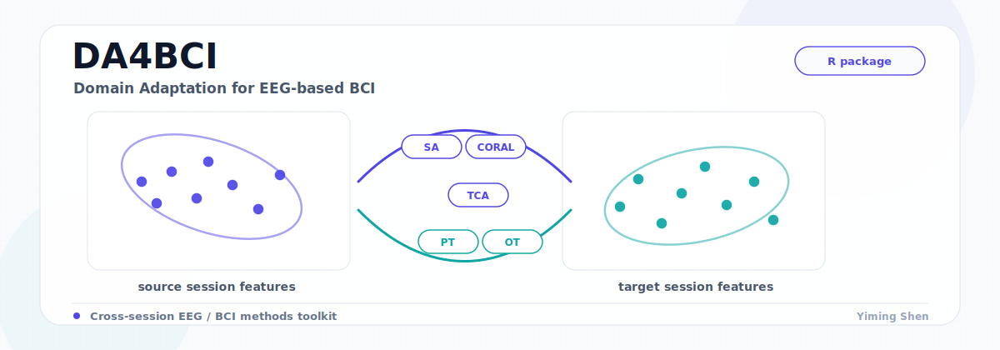

# DA4BCI

**A Unified Framework for Domain Adaptation in EEG-based Brain-Computer Interfaces.**

<p align="center">
  
</p>

R implementation of DA4BCI — a comprehensive toolkit of domain adaptation methods, distance metrics, and evaluation tools for EEG-based BCI applications. The package provides a unified interface to align EEG distributions across sessions or subjects, mitigating distributional shift and improving model robustness.

> Looking for the Python version? See [DA4BCI-Python](https://github.com/Yiming-S/DA4BCI-Python).

## Installation

Requires R >= 3.5.0.

```r
install.packages("remotes")
remotes::install_github("Yiming-S/DA4BCI", force = TRUE)
```

## Quick Start

```r
library(DA4BCI)

# Simulate EEG-like source and target features
set.seed(1)
source_data <- matrix(rnorm(100 * 20), 100, 20)
target_data <- matrix(rnorm(100 * 20) + 0.5, 100, 20)

# Apply domain adaptation (unified interface)
res <- domain_adaptation(
  source_data,
  target_data,
  method  = "coral",
  control = list(lambda = 1e-5)
)

adapted_source <- res$weighted_source_data
adapted_target <- res$target_data

# Quantify distribution alignment
distanceSummary(adapted_source, adapted_target, format = "table")
```

## Available Methods

All methods are dispatched through the unified `domain_adaptation()` function or can be called directly.

| Method    | Function                       | Description                                                |
| --------- | ------------------------------ | ---------------------------------------------------------- |
| **TCA**   | `domain_adaptation_tca`        | Transfer Component Analysis                                |
| **SA**    | `domain_adaptation_sa`         | Subspace Alignment                                         |
| **CORAL** | `domain_adaptation_coral`      | Correlation Alignment                                      |
| **GFK**   | `domain_adaptation_gfk`        | Geodesic Flow Kernel                                       |
| **MIDA**  | `domain_adaptation_mida`       | Maximum Independence Domain Adaptation                     |
| **RD**    | `domain_adaptation_riemannian` | Riemannian Distance alignment                              |
| **ART**   | `domain_adaptation_art`        | Aligned Riemannian Transport                               |
| **PT**    | `domain_adaptation_pt`         | Parallel Transport on the SPD manifold                     |
| **OT**    | `domain_adaptation_ot`         | Entropy-regularized Optimal Transport (Sinkhorn)           |
| **M3D**   | `domain_adaptation_m3d`        | Manifold-based Multi-step Domain Adaptation                |

## Evaluation Tools

DA4BCI includes a set of distance metrics for quantitatively assessing the effect of adaptation:

- **Euclidean Distance Matrix** — efficient pairwise distances between datasets.
- **Wasserstein Distance** — minimal transport cost between distributions.
- **Maximum Mean Discrepancy (MMD)** — kernel-based discrepancy, sensitive to subtle shifts.
- **Energy Distance** — empirical-distribution discrepancy from pairwise distances.
- **Mahalanobis Distance** — whitening-aware distance with optional shrinkage covariance.

The `distanceSummary()` function bundles these into a single table for quick before/after comparison.

```r
distanceSummary(
  source_data,
  target_data,
  include = c("MMD", "Energy", "Wasserstein", "Mahalanobis"),
  format  = "table"
)
```

## Algorithm Selection

For a practical method-selection guide organized by shift type, data representation, supervision level, and risk, see [ALGORITHM_SELECTION_GUIDE.md](ALGORITHM_SELECTION_GUIDE.md).

Quick rules of thumb:

- Start with `SA` and `CORAL` as fast linear baselines.
- If covariance structure dominates, move to `PT` and `ART`; keep `RD` as a lightweight baseline.
- If mismatch looks nonlinear or cluster-wise, try `OT`.
- If you have reliable source labels and need class-aware refinement, try `M3D`.

## Testing

```r
devtools::test()
```

## License

MIT

## Authors

- Yiming Shen — yiming.shen001@umb.edu
- David Degras — david.degras@umb.edu
